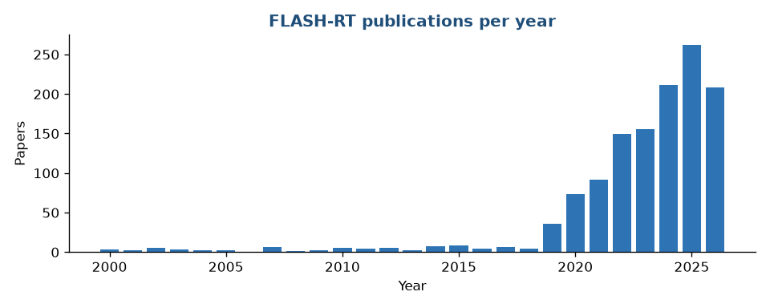

# FLASH Radiotherapy Living Literature Wiki

**AAPM · BESC · FLASH Working Group**

A continuously updated, categorized index of Medline-indexed FLASH radiotherapy
(ultra-high dose-rate) literature — with concise summaries and one-click citations.

<b>1,315</b>curated papers

<b>10</b>categories

<b>681</b>open access

<b>2026-08-14</b>last updated

## Browse by category

<a class="cat-card" href="radiobiology.html">442RadiobiologyIn vitro, in vivo and mechanistic studies of the FLASH effect, normal-tissue sparing, tumor response, oxygen and immune involvement.</a><a class="cat-card" href="physics-dosimetry.html">259Physics & DosimetryDetectors, reference dosimetry, beam monitoring and dose measurement under ultra-high dose-rate conditions.</a><a class="cat-card" href="modeling-mechanisms.html">171Modeling & MechanismsMonte Carlo, radiochemistry, oxygen-depletion and kinetic models explaining the FLASH effect.</a><a class="cat-card" href="beam-delivery-technology.html">122Beam Delivery & TechnologyAccelerators, LINAC conversions, laser-driven and VHEE sources, and beam-delivery hardware for UHDR.</a><a class="cat-card" href="treatment-planning-optimization.html">54Treatment Planning & OptimizationDose-rate-aware planning, optimization algorithms and delivery strategies for FLASH.</a><a class="cat-card" href="clinical-translational.html">40Clinical & TranslationalClinical trials, veterinary studies, first-in-human experience and translational workflow.</a><a class="cat-card" href="reviews-consensus.html">204Reviews & ConsensusReview articles, roadmaps, consensus statements and guidance documents.</a><a class="cat-card" href="opinions-debate.html">1Opinions & DebateOpinion essays and forward-looking perspectives on the promise, challenges and future of FLASH radiotherapy — argument rather than systematic evidence synthesis.</a><a class="cat-card" href="point-counterpoint.html">4Point-CounterpointFormal debate-column articles: Medical Physics Point/Counterpoint and the JACMP three-discipline collaborative radiation therapy (3DCRT) special debates, in which two parties argue opposing propositions.</a><a class="cat-card" href="perspectives-commentary.html">18Perspectives & CommentaryEditorials, letters, comments and retraction notices on FLASH radiotherapy.</a>

## Using this Wiki

Use the **search box** (top) to query across every title, abstract and author in the
corpus. Each entry links to PubMed and, where available, DOI and open-access full text.
Every paper shows a one-line **TL;DR** with the full abstract one click away.

This site is generated from a single source of truth (`flash_library.json`) produced by
an automated PubMed harvest pipeline. Re-running the pipeline refreshes every page — see
**[Methodology](methodology.md)** for the full workflow, and **[Downloads](downloads.md)**
for the master spreadsheet and citation library.
